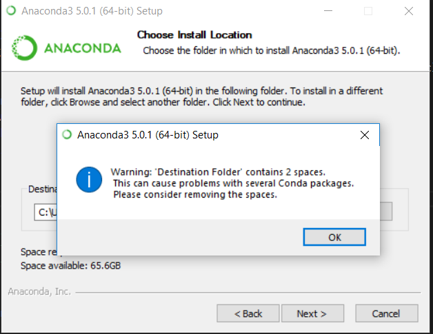

# Installation Anaconda on Windows

There are some phase installation that required before join DSW AI Camp by Nodeflux.

## What you need:
* Git
* Python (Anaconda3)
* Tensorflow
* Opencv

## Git Installation
1. Download git installer [here](https://git-scm.com/downloads)
2. Then Install it. You can set the instalation setting as you want (or just click next till the end)

## Anaconda Installation
1. Download Anaconda installer [here](https://www.anaconda.com/download/)
2. Choose Python 3.6 version and click Download
3. Then Install it.

### Noted



If you got this error, It might be happened because of `Destination Folder`. The `Destination Folder` should not have any spaces, e.g.: `C:\Users\Rizqi Okta E\Anaconda3`, it contains 2 spaces on `Rizqi(space)Okta(space)E`. To tackle this problem , you can change the `Destination Folder` to anywhere  which is without using any spaces, e.g.: `D:\Programming_Stuff\Anaconda3`

## Tensorflow and Opencv installation
1. Open `Anaconda Prompt` by click `Windows button` then type `Anaconda Prompt` and then click it.
2. Type ```conda install -c conda-forge opencv``` then press `enter` to install Opencv
3. Type `conda install tensorflow=1.4.1` then press `enter` to install tensorflow

## Testing Jupyter Notebook
After all you can checking the installation with running Jupyter Python Notebook.
1. Open `Anaconda Prompt`
2. Type `cd <path_to_DSW-Camp-AI>` e.g.: `cd C:\Users\Rizqi Okta E\Documents\DSW-Camp-AI`
3. Type `jupyter notebook`

## Finally
If you have some trouble about the installation, feel free to email me rizqi.okta@nodeflux.io.

